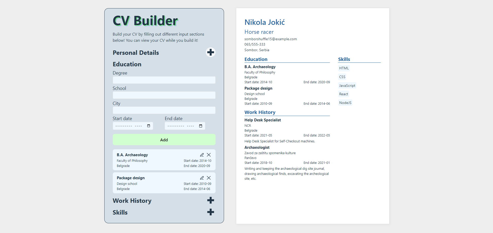

# CV Builder

A simple CV builder app which let's you type in your details on one side and see them displayed on CV on the other. There are 4 sections - Personal Details, Education, Work History and Skills. You can edit and delete education and work entries.

### <a href="https://adorable-zuccutto-278cbb.netlify.app/">VIEW HERE!</a>

## Implementation/Features

- Made my first app with React
- Used React state, props, keys, jsx, etc

---

